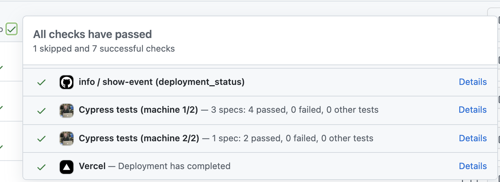

# cypress-set-github-status  [](https://github.com/bahmutov/cypress-set-github-status/actions/workflows/ci.yml)

> A little Cypress plugin for setting GitHub commit status



## Install

```
$ npm i -D cypress-set-github-status
# or if using Yarn
$ yarn add -D cypress-set-github-status
```

## Use

Register this plugin in your plugin file. Pick the GitHub owner and repo to send the status checks to. To pass the commit SHA you can use either an environment variable `TEST_COMMIT` or pass it via Cypress `--env testCommit=...` argument. For access, use [GitHub personal token](https://github.com/settings/tokens).

### Cypress v10+

Import this plugin from the config file

```js
// cypress.config.js
const { defineConfig } = require('cypress')

module.exports = defineConfig({
  e2e: {
    setupNodeEvents(on, config) {
      const commit = process.env.COMMIT_SHA || process.env.GITHUB_SHA
      const token = process.env.GITHUB_TOKEN || process.env.PERSONAL_GH_TOKEN
      const commonStatus = process.env.COMMON_STATUS || 'Cypress E2E tests'
      require('cypress-set-github-status')(on, config, {
        owner: '...',
        repo: '...',
        commit,
        token,
        // when finished the test run, after reporting its machine status
        // also set or update the common final status
        commonStatus,
      })
    },
  },
})
```

### Cypress v9

If you are using an older version of Cypress, import this plugin from your plugins file

```js
// cypress/plugins/index.js
module.exports = (on, config) => {
  // when we are done, post the status to GitHub
  // application repo, using the passed commit SHA
  // https://github.com/bahmutov/cypress-set-github-status
  require('cypress-set-github-status')(on, config, {
    owner: 'bahmutov',
    repo: 'todomvc-no-tests-vercel',
    commit: config.env.testCommit || process.env.TEST_COMMIT,
    token: process.env.GITHUB_TOKEN || process.env.PERSONAL_GH_TOKEN,
  })
}
```

## Examples

- [bahmutov/todomvc-tests-circleci](https://github.com/bahmutov/todomvc-tests-circleci)

## Bin scripts

### set-gh-status

See [bin/set-gh-status.js](./bin/set-gh-status.js) file. Typical use case

```
$ npx set-gh-status --owner <repo owner> \
  --repo <repo name> --commit <sha> \
  --status pending|success|failure|error \
  --context "short unique context" \
  --description "status description" \
  --target-url "optional URL to link to the status check"
```

### get-gh-pr-body

TODO: document this script

## commonStatus

If you have multiple parallel test runners, it might be necessary to create a single "common" status check with some constant context text to functions as the branch's required status. In this case, before starting the parallel test jobs set the status check using the bin `set-gh-status` script.

```
$ npx set-gh-status --owner <repo owner> --repo <repo name> \
  --commit ${{ github.event.pull_request.head.sha }} \
  --status pending \
  --context "Cypress E2E tests" \
  --description "tests about to start"
```

In the plugins file, add the field `commonStatus` to the options object. Use the same value as the `--context` argument.

```js
require('cypress-set-github-status')(on, config, {
  owner: 'owner name',
  repo: 'repo name',
  commit: process.env.COMMIT_SHA || process.env.GITHUB_SHA,
  token: process.env.GITHUB_TOKEN || process.env.PERSONAL_GH_TOKEN,
  // make sure to use the same common status as "--context" parameter
  commonStatus: 'Cypress E2E tests',
})
```

When running pass the head commit SHA via an environment variable

```
# point the plugin to update the commit status of the head commit
# TIP: we need to use an environment variable that does not start with GITHUB
# since those variables are set by the GitHub and can't be overridden
COMMIT_SHA: ${{ github.event.pull_request.head.sha }}
# use the same context as the above step
COMMON_STATUS: 'Cypress E2E tests'
```

Every machine that finishes will update the common status. If the status is pending / successful, and the new status is successful, it will remain successful. If the new status is failed, the status will change to failed and will remain failed.

## Blog posts

- [How to Keep Cypress Tests in Another Repo While Using CircleCI](https://glebbahmutov.com/blog/how-to-keep-cypress-tests-in-another-repo-with-circleci/)

## Upgrade

### v1 to v2

- if you ever used the script `get-pr-body`, now use the script `get-gh-pr-body`

## Small print

Author: Gleb Bahmutov &copy; 2022

- [@bahmutov](https://twitter.com/bahmutov)
- [glebbahmutov.com](https://glebbahmutov.com)
- [blog](https://glebbahmutov.com/blog/)
- [videos](https://www.youtube.com/glebbahmutov)
- [presentations](https://slides.com/bahmutov)
- [cypress.tips](https://cypress.tips)

License: MIT - do anything with the code, but don't blame me if it does not work.

Support: if you find any problems with this module, email / tweet /
[open issue](https://github.com/bahmutov/cypress-set-github-status/issues) on Github

## MIT License

Copyright (c) 2022 Gleb Bahmutov &lt;gleb.bahmutov@gmail.com&gt;

Permission is hereby granted, free of charge, to any person
obtaining a copy of this software and associated documentation
files (the "Software"), to deal in the Software without
restriction, including without limitation the rights to use,
copy, modify, merge, publish, distribute, sublicense, and/or sell
copies of the Software, and to permit persons to whom the
Software is furnished to do so, subject to the following
conditions:

The above copyright notice and this permission notice shall be
included in all copies or substantial portions of the Software.

THE SOFTWARE IS PROVIDED "AS IS", WITHOUT WARRANTY OF ANY KIND,
EXPRESS OR IMPLIED, INCLUDING BUT NOT LIMITED TO THE WARRANTIES
OF MERCHANTABILITY, FITNESS FOR A PARTICULAR PURPOSE AND
NONINFRINGEMENT. IN NO EVENT SHALL THE AUTHORS OR COPYRIGHT
HOLDERS BE LIABLE FOR ANY CLAIM, DAMAGES OR OTHER LIABILITY,
WHETHER IN AN ACTION OF CONTRACT, TORT OR OTHERWISE, ARISING
FROM, OUT OF OR IN CONNECTION WITH THE SOFTWARE OR THE USE OR
OTHER DEALINGS IN THE SOFTWARE.
